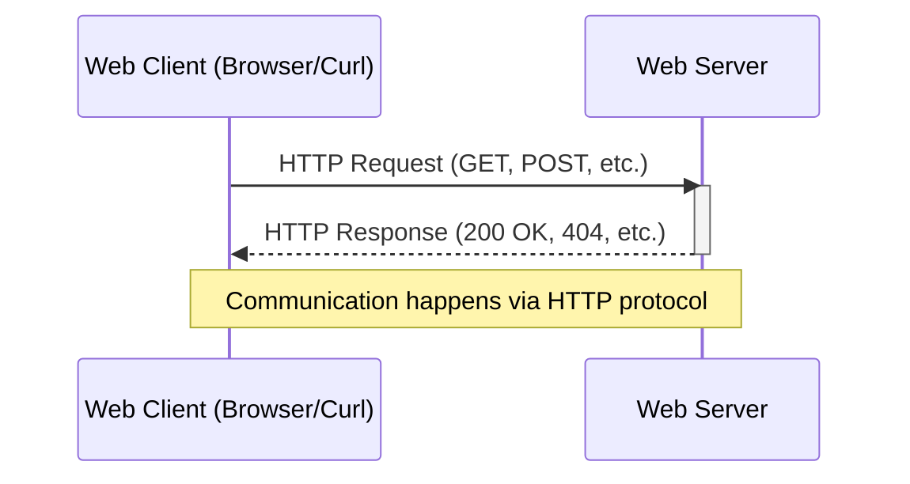

# `HTTP`

<h2>Table of contents</h2>

- [What is `HTTP`](#what-is-http)
- [Communication using `HTTP`](#communication-using-http)
- [`HTTPS`](#https)
- [`HTTP` request](#http-request)
  - [`HTTP` request method](#http-request-method)
  - [`HTTP` request header](#http-request-header)
  - [`HTTP` request payload](#http-request-payload)
- [`HTTP` response](#http-response)
- [`HTTP` response status code](#http-response-status-code)
- [Common `HTTP` response status codes](#common-http-response-status-codes)
  - [`200` (OK)](#200-ok)
  - [`201` (Created)](#201-created)
  - [`400` (Bad Request)](#400-bad-request)
  - [`401` (Unauthorized)](#401-unauthorized)
  - [`403` (Forbidden)](#403-forbidden)
  - [`404` (Not Found)](#404-not-found)
  - [`422` (Unprocessable Entity)](#422-unprocessable-entity)
  - [`500` (Internal Server Error)](#500-internal-server-error)
- [Send a `GET` request](#send-a-get-request)
  - [Send a `GET` request using a browser](#send-a-get-request-using-a-browser)
  - [Send a `GET` request using `curl`](#send-a-get-request-using-curl)

## What is `HTTP`

`HTTP` (`HyperText Transfer Protocol`) is the foundation of data communication on the web. This [protocol](./computer-networks.md#protocol) defines how messages are formatted and transmitted between [web servers](./web-infrastructure.md#web-server) and [web clients](./web-infrastructure.md#web-client).

## Communication using `HTTP`

The following diagram illustrates the communication between a [web client](./web-infrastructure.md#web-client) and [web server](./web-infrastructure.md#web-server) using the `HTTP` protocol:

## `HTTPS`

`HTTPS` (`HTTP Secure`) is the encrypted version of `HTTP`.
It encrypts the communication between a [web client](./web-infrastructure.md#web-client) and a [web server](./web-infrastructure.md#web-server) using `TLS`, preventing third parties from reading or tampering with the data in transit.

## `HTTP` request

An `HTTP` request is a message sent by a client to a server asking for resources or to perform actions. It includes a method, headers, and optional body.

</img>

[[Source](https://www.cloud4y.ru/upload/medialibrary/4c0/hn5x5w7tx2pa0t3m1us71vh51dthf4kg/2.jpg)]

### `HTTP` request method

An `HTTP` method is a verb that tells the server what action to perform on a resource.

Common methods:

- `GET` — retrieve a resource.
- `POST` — create a new resource.
- `PUT` — update an existing resource.
- `DELETE` — remove a resource.

### `HTTP` request header

`HTTP` request headers are key-value pairs sent alongside a request that provide metadata — such as the format of the data being sent, what response formats the client accepts, or authentication credentials.

Common headers:

- `Content-Type` — the format of the [request payload](#http-request-payload) (e.g., `application/json`).
- `Authorization` — credentials used to authenticate the request (e.g., an API key or token).
- `Accept` — the response formats the client can handle (e.g., `application/json`).

### `HTTP` request payload

An `HTTP` request payload (also called the request body) is optional data sent with a request. Methods such as `POST` and `PUT` use a payload to send data to the server — for example, a `JSON` object when creating a new resource.

The [`Content-Type`](#http-request-header) header tells the server how to interpret the payload.

## `HTTP` response

An `HTTP` response is the server's answer to an `HTTP` request, containing status information and requested content.

## `HTTP` response status code

Status codes are three-digit numbers returned by servers indicating the result of a request (success, error, redirect, etc.).

## Common `HTTP` response status codes

### `200` (OK)

[`200` (OK)](https://developer.mozilla.org/en-US/docs/Web/HTTP/Reference/Status/200) — the request succeeded.

### `201` (Created)

[`201` (Created)](https://developer.mozilla.org/en-US/docs/Web/HTTP/Reference/Status/201) — a new resource was created (typically after `POST`).

### `400` (Bad Request)

[`400` (Bad Request)](https://developer.mozilla.org/en-US/docs/Web/HTTP/Reference/Status/400) — the request was malformed.

### `401` (Unauthorized)

[`401` (Unauthorized)](https://developer.mozilla.org/en-US/docs/Web/HTTP/Reference/Status/401) — authentication is required or the credentials are invalid.

### `403` (Forbidden)

[`403` (Forbidden)](https://developer.mozilla.org/en-US/docs/Web/HTTP/Reference/Status/403) — the server understood the request but refuses to authorize it.

### `404` (Not Found)

[`404` (Not Found)](https://developer.mozilla.org/en-US/docs/Web/HTTP/Reference/Status/404) — the requested resource does not exist.

### `422` (Unprocessable Entity)

[`422` (Unprocessable Entity)](https://developer.mozilla.org/en-US/docs/Web/HTTP/Reference/Status/422) — the request was well-formed but had invalid data.

### `500` (Internal Server Error)

[`500` (Internal Server Error)](https://developer.mozilla.org/en-US/docs/Web/HTTP/Reference/Status/500) — an unexpected server error occurred.

## Send a `GET` request

<!-- no toc -->
- Method 1: [Send a `GET` request using a browser](#send-a-get-request-using-a-browser)
- Method 2: [Send a `GET` request using `curl`](#send-a-get-request-using-curl)

### Send a `GET` request using a browser

1. Open the [URL](./computer-networks.md#url) in a browser.

   The browser sends the `GET` request by default.

### Send a `GET` request using `curl`

See [`curl`](./useful-programs.md#send-a-get-request-with-curl).
